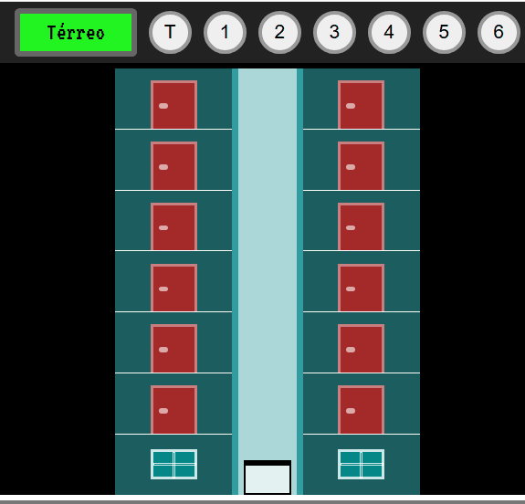

# Elevador Dinâmico

</img>

## 🔮 O que é este projeto 
Este projeto é uma simulação de um elevador interativo com HTML, CSS e JavaScript, desenvolvido como parte da formação em Desenvolvimento Web.

## 💻 Como executar este projeto
Para rodar o projeto basta acionar o andar desejado (que varia do Térreo ao 6° andar) nos botões localizados acima do projeto e então o elevador se movimenta até atingir o andar escolhido. Há um visor lateral que identifica o andar de destino, bem como a direção do movimento (se subindo ou descendo).

## ⚙️ Tecnologias usadas no projeto

## 💎 Funcionalidades
- Subida e descida de elevador com animação
- Botões com destaque visual
- Mostrador dinâmico
- Geração automática de faixas e pavimentos

## ⭐Sobre Mim
Sou Bárbara Dantas, profissional em transição de carreira com mais de 10 anos de experiência em gestão e educação. Atualmente estudo Desenvolvimento Web com foco em front-end (HTML, CSS, JavaScript) e busco minha primeira oportunidade como desenvolvedora júnior ou estagiária.

----------

Feito com 💟 por Bárbara e Prof Leonardo Leitão - Cod3r .

